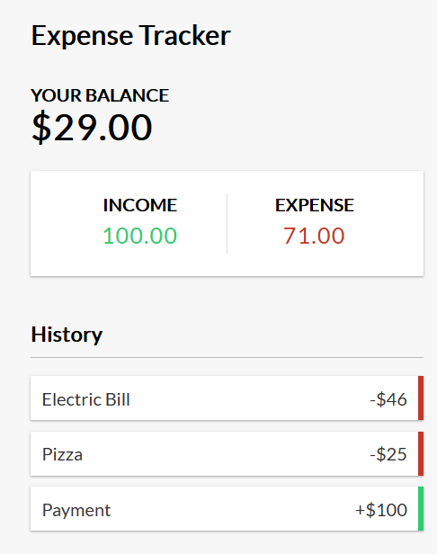
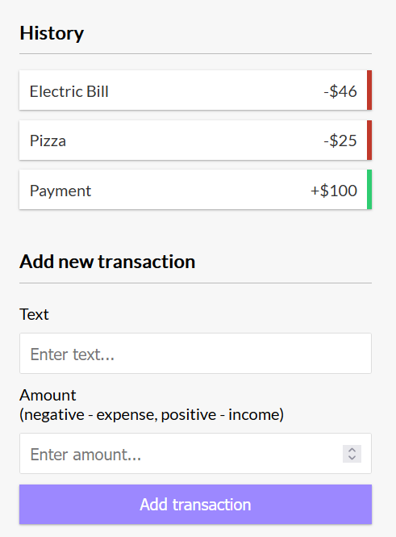

# expense-tracker-react

React Expense Tracker

<!-- Live link to deployed app -->

Repository: https://github.com/Mdudzik92/React-Expense-Tracker 
Deployed app: https://mdudzik92.github.io/React-Expense-Tracker/

<!-- Technologies used -->

React.js, React Hooks, JSX, JavaScript, CSS, HTML

<!-- Explanation of what the app is -->

This is an Expense Tracker app in which the user can add to or deduct from their current amount with the use of functional components using hooks and the context API.

<!-- Screenshots -->

<!-- License -->

MIT

<!-- Contact information -->

Email: mdudzik92@gmail.com
